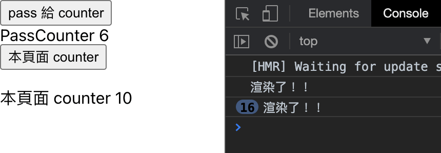
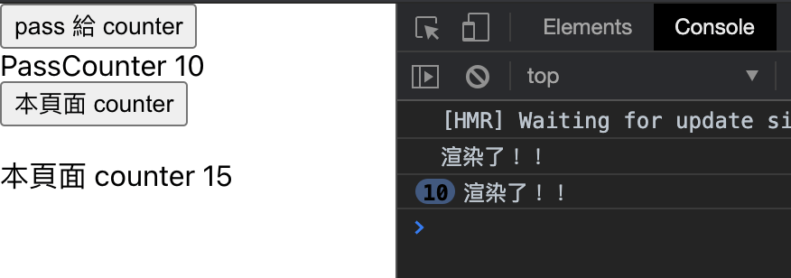

# [React.PureComponent](https://reactjs.org/docs/react-api.html#reactpurecomponent)

官方網站是這樣說的

`React.PureComponent` is similar to `React.Component`. The difference between them is that `React.Component` doesn’t implement `shouldComponentUpdate()`, but `React.PureComponent` implements it with a shallow prop and state comparison.

沒錯，React.Component ，與 React.PureComponent 的差別是 PureComponent 用 shallow compare 實做了 shouldComponentUpdate 方法，對前後兩個 state 或 props 進行比較，

但是要注意

如果傳入的 props 或是 state 是會每次都變動的值，就不需要用 PureComponent，用原本的 Component 就好了

---

## 實作 PureComponent

預設在 app.js 新增兩個按鈕，一個按鈕的 data 會 pass 到 PassCounter 的元件，另一個按鈕的 data 是呈現在該頁面

    function App() {
      const [passCounter, setPassCounter] = useState(0);
      const [thisPageCounter, setThisPageCounter] = useState(0);
      return (
        <div className="App">
          <button onClick={() => setPassCounter(passCounter + 1)}>
            pass 給 counter
          </button>
          <Counter num={passCounter} />
          <button onClick={() => setThisPageCounter(thisPageCounter + 1)}>
            本頁面 counter
          </button>
          <p>本頁面 counter {thisPageCounter}</p>
        </div>
      );
    }

然後 PassCounter 我們先用一般的 Component，然後在 render 下面放一個 console 測試是不是有 render

    import React, { Component } from "react";
    class PassCounter extends Component {
      render() {
        console.log("渲染了！！");
        return <div>PassCounter {this.props.num}</div>;
      }
    }
    export default PassCounter;



發現在本頁面 set counter 的 data 時，PassCounter 的元件也被渲染了

那現在把原本 Component 換成 PureComponent

```

import React, { PureComponent } from "react";
class Counter extends PureComponent {
  render() {
    console.log("渲染了！！");
    return <div>PassCounter {this.props.num}</div>;
  }
}
export default Counter;
```



恩恩，很成功地去擋掉不必要的渲染了！！

### function component 的 PureComponent

剛剛是在 class component 去引用 PureComponent，但如果在 function component 要怎麼用 pureComponent 呢？

其實 react 本身有開 memo 功能

# React.memo

跟 PureComponent 一樣 `React.memo` 只會確認 props 的改變。如果需要控制比較的方法，你可以提供一個自訂的比較 function 作為第二個參數。

    function MyComponent(props) {
      /* render using props */
    }
    function areEqual(prevProps, nextProps) {
      /*
      return true if passing nextProps to render would return
      the same result as passing prevProps to render,
      otherwise return false
      */
    }
    export default React.memo(MyComponent, areEqual);

官方網站也有註明

> 備註
> 與 class component 的 `shouldComponentUpdate()` method 不同,`areEqual` function 當 prop 相等的時候回傳 `true`，不相等的時候回傳 `false`。 這跟 `shouldComponentUpdate`剛好相反。

所以剛剛的 PureComponent 改成用 memo 這樣寫就可以囉

```
import React, { memo } from "react";
const Counter = ({ num }) => {
  console.log("渲染了！！");
  return (
    <div>
      <div>PassCounter {num}</div>
    </div>
  );
};
export default memo(Counter);
```

---

[reference]

[React.PureComponent’s children.](https://blog.cloudboost.io/react-purecomponents-children-979e3da15ba8)

[React 效能優化 — PureComponent](https://medium.com/@xyz030206/react-效能優化-purecomponent-f971fb56f90a)

[React, Inline Functions, and Performance](https://cdb.reacttraining.com/react-inline-functions-and-performance-bdff784f5578)

---

> 似乎好像對於效能有了敲門磚的感覺～
