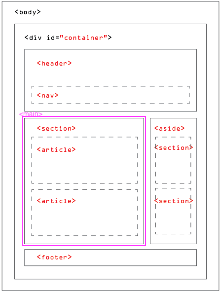
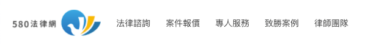
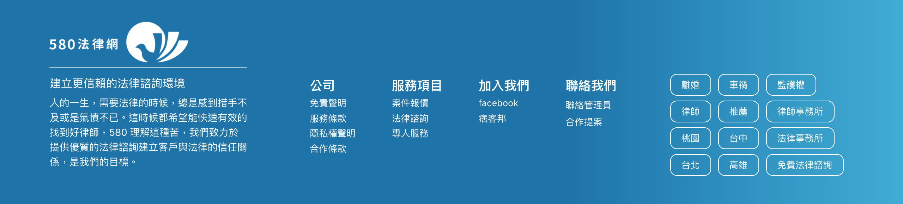
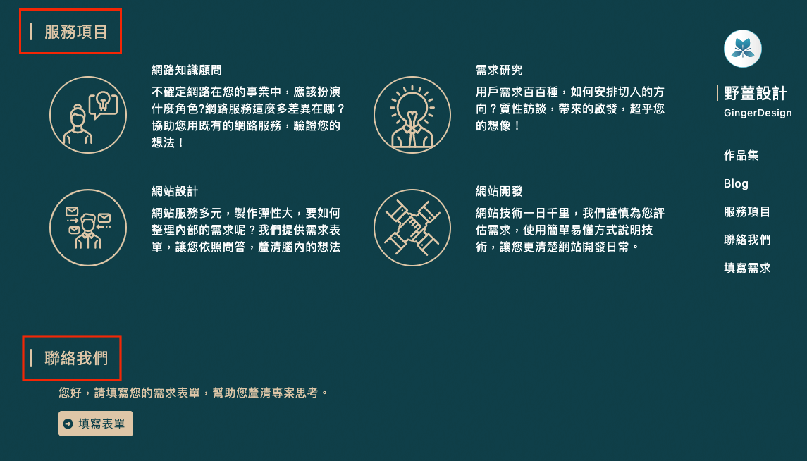
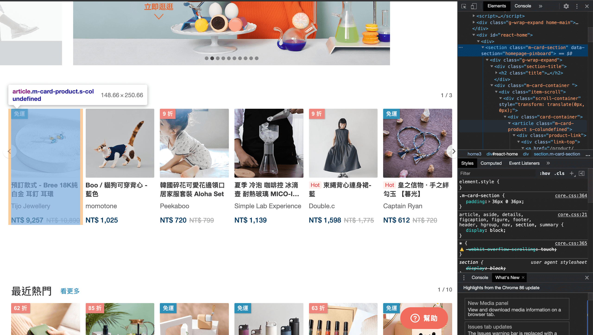
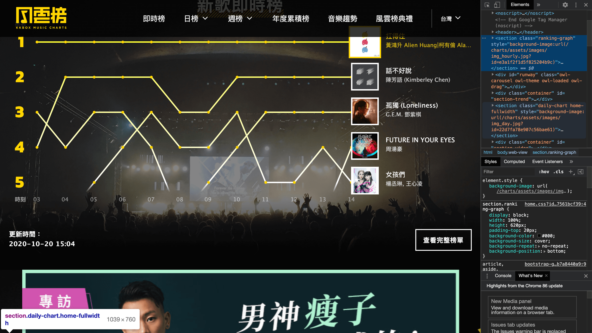

其實這篇應該要在 [SEO 開發注意事項 - 語意標記](https://blog.hidana.me/SEO 開發注意事項 - 語意標記/) 前，畢竟要先有骨幹才能有肉可以填 😂

`SEO 開發注意事項` 系列

- [SEO 開發注意事項 - 語意標籤](https://blog.hidana.me/SEO 開發注意事項 - 語意標籤/)
- [SEO 開發注意事項 - 語意標記](https://blog.hidana.me/SEO 開發注意事項 - 語意標記/)

---

語意標籤目的主要是讓 seo 爬蟲，可以清楚知道網站架構，然後他可以把你的網站更有效地做整理，呈現在搜尋結果頁面

# 標籤注意事項

可以在 [w3c 語意標籤列表](https://www.w3schools.com/tags/default.asp) 看到很多語意標籤的列表

如果不清楚的話，可以看 [HTML Living Standard](https://html.spec.whatwg.org/multipage/#toc-semantics) 更詳細的解說

這邊就不一個一個列舉，主要是拉出幾個要注意的地方

## 架構要明確

在標籤使用的架構大概如下



( this image is from [HTML5 SEO 語意結構區塊](https://www.fooish.com/html/SEO-semantic-layout.html) )

**一個頁面只會有一個 `<body>` 一個 `<header>` 一個 `<footer>` 一個 `<main>`**

**而 `<main>` 會標注在頁面不重複內容的地方**

所以如果網站架構是有個 layout 的話，可以這樣寫

```
<>
  <Header />
  <main>
    <Component {...props} />
  </main>
  <Footer />
</>
```

## header 裡的 nav，可以放在 footer 嗎？

因為 header 要把用戶的注意力專注，所以通常都會選網站主要功能來放，而過往 footer 只有放 copyright 或是公司名稱，但是現在其實也會放些 隱私權 之類的，甚至比 header 還要詳細，這時就會疑惑，所以在 footer 的 menu 也要放 `<nav>` 的 tag 嗎？

比如說拿 [580 律師網](https://www.law580.com.tw/) 來舉例

header


footer


[HTML Living Standard 是這麼說 `<nav>` 的](https://html.spec.whatwg.org/multipage/sections.html#the-nav-element)

> Not all groups of links on a page need to be in a `<nav>` element — the element is primarily intended for sections that consist of major navigation blocks. In particular, it is common for footers to have a short list of links to various pages of a site, such as the terms of service, the home page, and a copyright page. The footer element alone is sufficient for such cases; while a `<nav>` element can be used in such cases, it is usually unnecessary.

[MDN 的 `<nav>` 解釋](https://developer.mozilla.org/zh-TW/docs/Web/HTML/Element/nav)

> 文件可以有很多個 `<nav>` 元素。例如說，一個用做網站導覽、另一個用做頁內導覽。

**所以其實如果 footer 有其他有別於 header 的 link 連結，是適合放 nav 的**

## `<h1>` to `<h6>`

在做標題時，其實我們都會用 `<h1>` 表示大標，然後呢？就開始隨便用之類的，但其實這使用方式也會跟 seo 有關

**一個頁面只會有一個 `<h1>`**，這是讓 seo 爬蟲告訴你這頁面最重要的東西是哪個

比如在一篇文章，最重要的是 文章標題，那就會用 `<h1>文章標題</h1>` 標註起來，方便 seo 爬蟲識別

而文章內文的大標題，就可以使用 `<h2>` 來標注，以此類推到 `<h3>`

從 `<h4>` 開始就是 ~~不重要的開始~~ 用在常態標注，比如說一個 section 的 header 就可以用 `<h4>`

拿 [野薑官網](https://gingerdesign.com.tw/about/) 來說，下列紅色框框內的，`服務項目` 以及 `聯絡我們` 就是適合使用 `<h4>`



而 `h5` 就是來輔助 `h4` 標籤使用

## `<div>` vs `<section>`

好歐，開頭貼的 [w3c 語意標籤列表](https://www.w3schools.com/tags/default.asp) 解釋 div 的意思是

> The `<div>` tag defines a division or a section in an HTML document.

誒？！！看到時很開心，以為 div 大神可以直接取代 section 這樣，但其實根本不行

看了 [HTML Living Standard](https://html.spec.whatwg.org/multipage/#toc-semantics) 的解說 `<div>`

> The `<div>` element has no special meaning at all. It represents its children. It can be used with the class, lang, and title attributes to mark up semantics common to a group of consecutive elements.

> Note: Authors are strongly encouraged to view the `<div>` element as an element of last resort, for when no other element is suitable. Use of more appropriate elements instead of the `<div>` element leads to better accessibility for readers and easier maintainability for authors.

而對 `<section>` 也有特別註釋

> The section element is not a generic container element. When an element is needed only for styling purposes or as a convenience for scripting, authors are encouraged to use the div element instead. A general rule is that the section element is appropriate only if the element's contents would be listed explicitly in the document's outline.

所以其實 `<div>` 是沒有任而意義的標籤，如果是需要處理 style 但不需要特別標記 `<section>` 的地方，建議可以使用 `<div>` 直接定義 class 直接使用

## `<section>` vs `<article>`

好拉，看了這麼多，就來到讓我覺得最難分清楚的地方了

我們先來看看個別定義

### [`<section>`](https://html.spec.whatwg.org/multipage/sections.html#the-section-element)

> The section element represents a generic section of a document or application. A section, in this context, is a thematic grouping of content, typically with a heading.

> Examples of sections would be chapters, the various tabbed pages in a tabbed dialog box, or the numbered sections of a thesis. A web site's home page could be split into sections for an introduction, news items, and contact information.

> Authors are encouraged to use the article element instead of the section element when it would make sense to syndicate the contents of the element.

### [`<article>`](https://html.spec.whatwg.org/multipage/sections.html#the-article-element)

> The article element represents a complete, or self-contained, composition in a document, page, application, or site and that is, in principle, independently distributable or reusable, e.g. in syndication. This could be a forum post, a magazine or newspaper article, a blog entry, a user-submitted comment, an interactive widget or gadget, or any other independent item of content.

好歐，也太抽象了

來看看 stackoverflow 裡的舉例 [Section vs Article HTML5](https://stackoverflow.com/questions/7549561/section-vs-article-html5)

> In our example, `<section id="main">` contains blog entries. Each blog entry would be suitable for syndicating as an item in an RSS feed, and would make sense when read on its own, out of context, therefore <article> is perfect for them:

```
<section id="main">
    <article>
      <!-- first blog post -->
    </article>

    <article>
      <!-- second blog post  -->
    </article>

    <article>
      <!-- third blog post -->
    </article>
</section>
```

> For example, if each one of these blog posts has a consistent structure of distinct sections, then you could put sections inside your articles as well. It could look something like this:

```
<article>
  <section id="introduction">
  </section>

  <section id="content">
  </section>

  <section id="summary">
  </section>
</article>
```

看起來就清楚多了，section 跟 article 可以互相千套

section 裡面的 article 是個別一個獨立體

而 article 裡的 section 像是一個段落

嗯，看起來好像似乎懂了，但是實際應用就又覺得怪怪的
那就直接拿別人的網站來參考好了

### 如果頁面有卡片式的話

可以可以看到 article 是一張卡片，而包含全部 article 就是 section



### 如果頁面是整頁都是相關內容的活動頁的話

看起來也是可以一個區塊一個 section 的切



嗯，看起來好像有一點心得了呢！

---

`SEO 開發注意事項` 系列

- [SEO 開發注意事項 - 語意標籤](https://blog.hidana.me/SEO 開發注意事項 - 語意標籤/)
- [SEO 開發注意事項 - 語意標記](https://blog.hidana.me/SEO 開發注意事項 - 語意標記/)

---

[reference]

[HTML5 SEO 語意結構區塊](https://www.fooish.com/html/SEO-semantic-layout.html)

[Document and website structure](https://developer.mozilla.org/en-US/docs/Learn/HTML/Introduction_to_HTML/Document_and_website_structure#Enter_HTML5_structural_elements)

\* [HTML5 nav element inside footer](https://stackoverflow.com/questions/11637978/html5-nav-element-inside-footer)

[Links inside HTML5 footer element (nav and aside?)](https://stackoverflow.com/questions/7645357/links-inside-html5-footer-element-nav-and-aside)

[HTML `<h1>` to `<h6>` Tags](https://www.w3schools.com/tags/tag_hn.asp)

[HTML 標題語法 H1 至 H6 的使用原則和 SEO 的影響因素](https://wp-valley.com/html-headings)

[Section vs Article HTML5](https://stackoverflow.com/questions/7549561/section-vs-article-html5)

---

> 這週其實人不太舒服，寫這篇時就在想是不是平常應該要存一兩篇，以便自己不舒服時可以拿來頂用～健康真的很重要啊～～～
