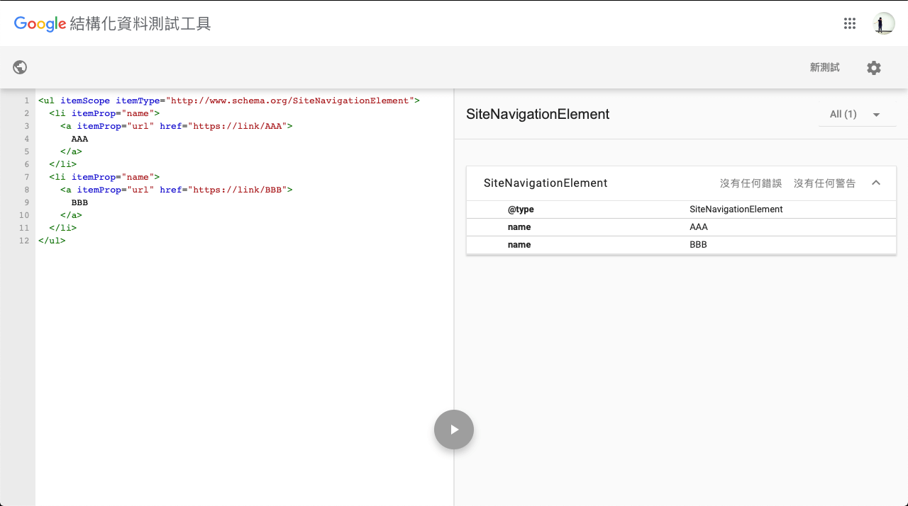
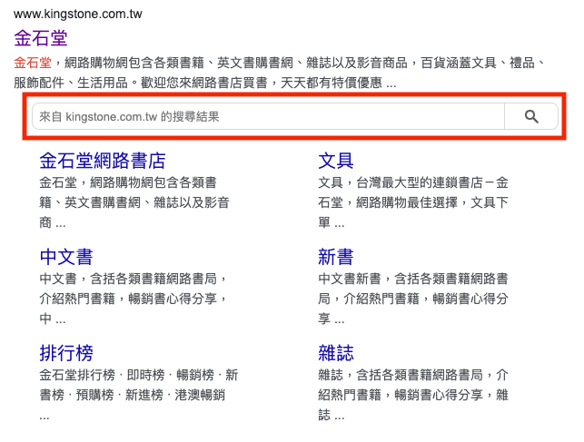
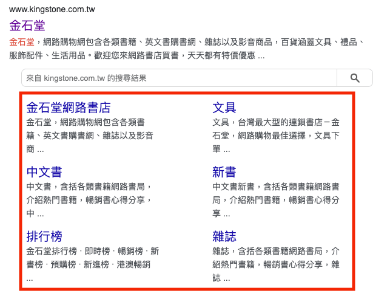

語意標記大多在於寫完語意標籤後填上去，也因為不同形式有不同方式填寫

`SEO 開發注意事項` 系列

- [SEO 開發注意事項 - 語意標籤](https://blog.hidana.me/SEO 開發注意事項 - 語意標籤/)
- [SEO 開發注意事項 - 語意標記](https://blog.hidana.me/SEO 開發注意事項 - 語意標記/)

---

在做語意標記時，其實有幾種寫法可以認識，我們這邊介紹兩種比較常見的標記方式

## microdata

寫在 html tag 裡面的標記

```
<div itemscope itemtype="http://schema.org/WebSite"></div>
```

## JSON-LD

### 另外在 script 寫的 JSON-LD

記，雖然是 script 但是會放在 head 裡面

```
<script type="application/ld+json">
  {
     "@context": "http://schema.org",
     "@type": "BreadcrumbList"
  }
</script>
```

在 react 的話，可以寫在 [react-helmet](https://github.com/nfl/react-helmet) 裡

```
<Helmet>
  {/* inline script elements */}
    <script type="application/ld+json">{`
        {
            "@context": "http://schema.org"
        }
    `}</script>
</Helmet>
```

用 [react-helmet](https://github.com/nfl/react-helmet) 也可以用變數帶進去，但記得要 `JSON.stringify()`

```
const ldJson = {
  "@context": "https://schema.org",
  "@type": "BreadcrumbList",
  "itemListElement": [{
    "@type": "ListItem",
    "position": 1,
    "name": "Blogs",
    "item": "https://www.speblog.org"
  },{
    "@type": "ListItem",
    "position": 2,
    "name": head.title,
    "item": window.location.href
  }]
};

...

<Helmet>
  <script type="application/ld+json">
    {JSON.stringify(ldJson)}
  </script>
</Helmet>
```

這時就會疑惑，如果有 麵包削、站內搜尋 很多 JSON-LD 怎麼辦？

### 放在不同 script

```
<script type="application/ld+json">
{
  "@context": "http://schema.org",
  "@type": "Organization"
}
</script>

<script type="application/ld+json">
{
  "@context": "http://schema.org",
  "@type": "BreadcrumbList"
}
</script>
```

### 用 array

```
<script type="application/ld+json">
[
  {
     "@context": "http://schema.org",
     "@type": "Organization"
  },
  {
     "@context": "http://schema.org",
     "@type": "BreadcrumbList"
  }
]
</script>
```

### 用 @graph

```
<script type="application/ld+json">
{
  "@context": "http://schema.org",
  "@graph":
  [
    {
       "@type": "Organization"
    },
    {
       "@type": "BreadcrumbList"
    }
  ]
}
</script>
```

---

# 測試語意標記

### 結構化資料測試工具

google 有推 [結構化資料測試工具](https://search.google.com/structured-data/testing-tool/u/0/) 可以讓我們更容易去測試自己設定的語意標籤是否正確

可以用網頁連結，或是程式碼來測試



---

# 常用語意標記

語意標記遵循 [schema.org](https://schema.org/WebSite) 方式，依照不同需求會有不同的標記設定方式，以下取三個比較常見到的標記

[schema.org](https://schema.org/WebSite) 除了解釋標記格式，底下也有範例可以直接拿來測試使用歐！

## SearchAction 站內搜尋標記

[schema-searchAction](https://schema.org/SearchAction)

在 google 搜尋 "金石堂" 或是 "露天" ，可以看到在 google 搜尋結果頁面，會有一個像搜尋匡的東西，用戶可以在這邊直接搜尋，然後導到我們網站自己的搜尋結果頁



### JSON-LD

```
<script type="application/ld+json">
{
   "@context": "http://schema.org",
   "@type": "WebSite",
   "name": "WebSite name",
   "url": "https://website.url/",
   "potentialAction": {
     "@type": "SearchAction",
     "target": "https://searchpage.url?&Description={search_term}",
     "query-input": "required name=search_term"
   }
}
</script>
```

### Microdata

```
<div itemscope itemtype="http://schema.org/WebSite">
  <meta itemprop="url" content="[website url]"/>
  <form itemprop="potentialAction" itemscope itemtype="http://schema.org/SearchAction">
    <meta itemprop="target" content="[website search url]={search_term}"/>
    <input itemprop="query-input" type="text" name="search_term">
    <input type="submit">
  </form>
</div>
```

## siteNavigation 網站導覽標記

[schema-siteNavigation](https://schema.org/SiteNavigationElement)

在搜尋結果下方，會有類似下面這些清單，這些清單可以藉由設定 sitelink 協助搜尋引擎了解，但實際會依照外部連結熱絡度而顯示出來



### JSON-LD

```
<script type="application/ld+json">
{
  "@context":"http://schema.org",
  "@type":"ItemList",
  "itemListElement":
    [
      {
        "@type": "SiteNavigationElement",
        "position": 1,
        "name": "Startseite",
        "description": "example",
        "url":"https://www.example/2.com/"
      },
      {
        "@type": "SiteNavigationElement",
        "position": 2,
        "name": "Example1",
        "description": "exapmle1",
        "url":"https://www.example/3.com"
      }
    ]
}
</script>
```

### Microdata

```
<ul itemScope itemType="http://www.schema.org/SiteNavigationElement">
  <li itemProp="name">
    <a itemProp="url" href="https://link/AAA">
      AAA
    </a>
  </li>
  <li itemProp="name">
    <a itemProp="url" href="https://link/BBB">
      BBB
    </a>
  </li>
</ul>
```

## breadcrumbList 麵包削標記

在網頁搜尋結果，如果有出現這一條，其實會讓使用者在搜尋頁面時，就清楚網頁整個架構，進而提升用戶點擊的意願性


### JSON-LD

```
{
  "@context": "https://schema.org",
  "@type": "BreadcrumbList",
  "itemListElement":
  [
    {
    "@type": "ListItem",
    "position": 1,
    "item":
    {
      "@id": "https://example.com/dresses",
      "name": "Dresses"
      }
    },
    {
    "@type": "ListItem",
    "position": 2,
    "item":
    {
      "@id": "https://example.com/dresses/real",
      "name": "Real Dresses"
    }
    }
  ]
}
```

### Microdata

```
<ol itemScope itemType="http://schema.org/BreadcrumbList">
  <li
    itemProp="imteListElement"
    itemScope
    itemType="http://schema.org/ListItem"
  >
    <a itemProp="item" href="https://link">
      <span itemProp="name">Home</span>
    </a>
    <meta itemProp="position" content="1" />
  </li>
  <li
    itemProp="imteListElement"
    itemScope
    itemType="http://schema.org/ListItem"
  >
    <a itemProp="item" href="https://link">
      <span itemProp="name">secPage</span>
    </a>
    <meta itemProp="position" content="2" />
  </li>
</ol>
```

---

在網頁加上 語意標記 時，有時候會思考要怎麼處理，可以用比較容易的方式產生標記。尤其在處理 siteNavigation 時，原先打算用 microdata 直接寫在 header 網頁網頁，但加到一半時覺得 jsx 看起來很凌亂，後來還是決定使用 JSON-LD 的方式去產生。

雖然 google 傾向用 JSON-LD ，但其實大多取決於開發情境來找一個比較方便快速的做法

`SEO 開發注意事項` 系列

- [SEO 開發注意事項 - 語意標籤](https://blog.hidana.me/SEO 開發注意事項 - 語意標籤/)
- [SEO 開發注意事項 - 語意標記](https://blog.hidana.me/SEO 開發注意事項 - 語意標記/)

---

[reference]

[用結構化資料與 Google 溝通，分析結構化資料的優點、寫法](https://www.awoo.com.tw/blog/structured-data/)

[React Helmet adds ld+json outside </html>](https://stackoverflow.com/questions/59294325/react-helmet-adds-script-type-application-ldjson-outside-html)

[How do you combine several JSON-LD markups?](https://stackoverflow.com/questions/48294593/how-do-you-combine-several-json-ld-markups)

[Google Search sitelink(JSON-LD)](<(http://jacwang.blogspot.com/2017/01/google-search-sitelinkjson-ld.html)>)

[Can I use a friendly URL on SearchAction?](https://stackoverflow.com/questions/54248725/can-i-use-a-friendly-url-on-searchaction)

[自訂您的網站在搜尋結果中呈現的樣子](https://www.astralweb.com.tw/style-your-site-results-in-google-search/)

[How to implement the SiteNavigationElement with JSON LD](https://support.google.com/webmasters/thread/11476324?hl=en)

---

> 在已完成的專案，依 SEO 修正加上語意標記真的是很刺激的選擇
