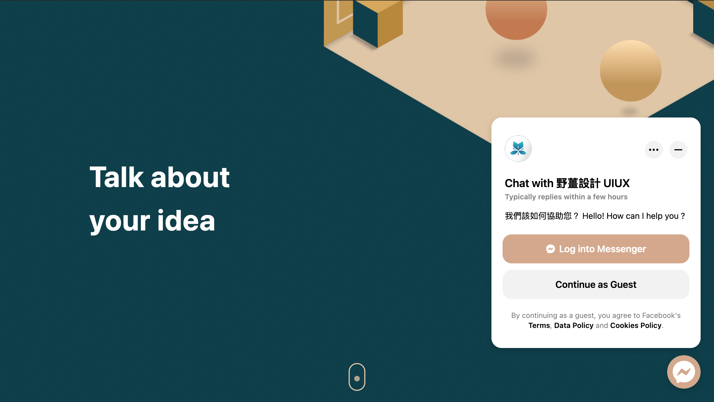
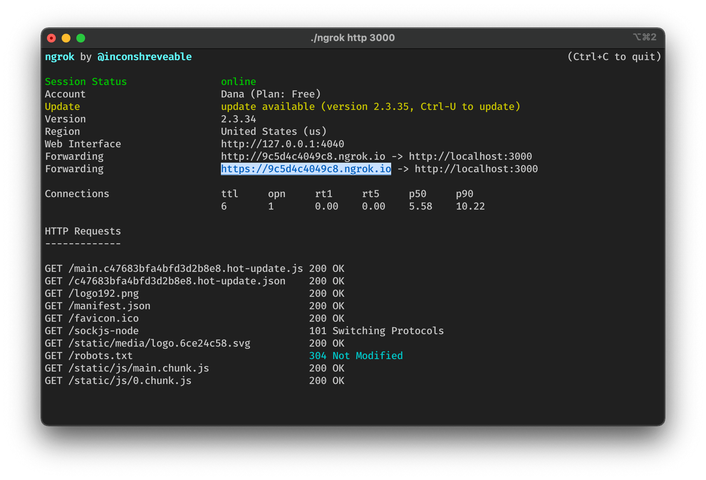
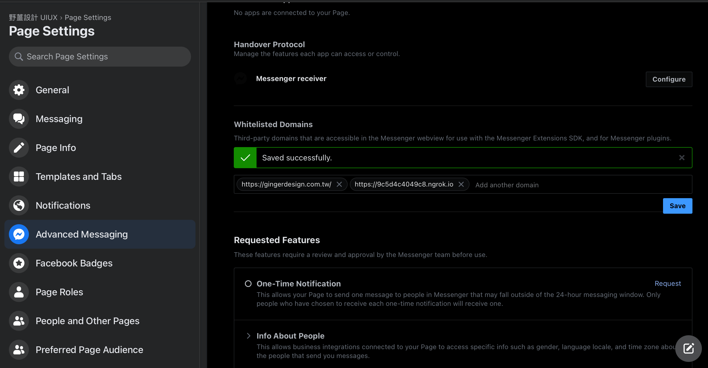
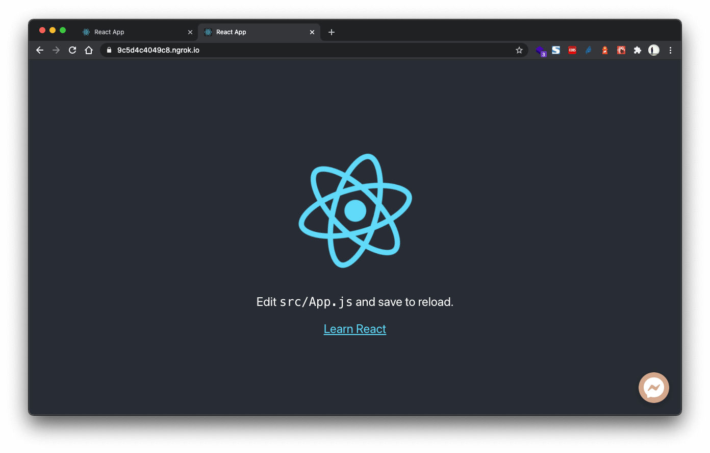

有時候本身有 fb 粉絲頁，也有官方網站，就可以用 facebook messenger plugin 來做兩個平台的連接，這樣潛在客戶就可以直接用官網通到粉絲頁的 messenger

[FB Chat Plugin 官方文件](https://developers.facebook.com/docs/messenger-platform/discovery/facebook-chat-plugin/#browser_support)

通常這時大多可能是 PM 是申請好，就丟一長串的 js script code 要你安裝在平台上，這 code 有一半是安裝 FB 的 SDK 另外一半就是設定 chat plugin

這次我們不使用 fb 給的 js code，我們使用台灣人自己開發的 package

## react-messenger-customer-chat

[react-messenger-customer-chat](https://www.npmjs.com/package/react-messenger-customer-chat)

    $npm i react-messenger-customer-chat

使用也是直接使用

    import MessengerCustomerChat from "react-messenger-customer-chat";
    ...

    

       <MessengerCustomerChat
          pageId="<PAGE_ID>"
          appId="<APP_ID>"
        />
    

- <PAGE_ID> 可以在 紛絲頁 > about 下面找到
- <APP_ID> 跟 fb 分享的 id 是一樣的，在 facebook develop 下面 app 的 id

**[ 要注意！！]**

設置好後，在本地 localhost:3000 是看不到的，這個 package 要跟 fb 串接成功才會顯示

這邊測試超久以為自己遇到神奇的 bug 😭

## 串接實體位置

可以放在遠端 server 或是本地用 [ngrok](https://ngrok.com/) 導一個實體位置

本地專案先起在 localhost 3000，再用 ngrok 指向 3000

    ./ngrok http 3000

最後再去 粉絲頁 > setting > advanced message > whitelisted domains 設定
把剛剛 ngrok 起的位置貼到 紛絲頁設定上

再訪問剛剛 ngrok 的位置，就可以看到右下角有我們要的 messenger 了呦！

---

[reference]

[Add Facebook messenger customer chat in React App.](https://www.youtube.com/watch?v=8e_4KIj4jBs)

[Customer chat not working with React Messenger Customer Chat](https://stackoverflow.com/questions/64485630/customer-chat-not-working-with-react-messenger-customer-chat)

---

> 久違的短短文章，也是今年的第一篇文章呢！這次是先在粉絲頁設定好再接 plugin ，不過看他設定的方式，或許可以試試不在粉絲頁設定好而直接串接～
