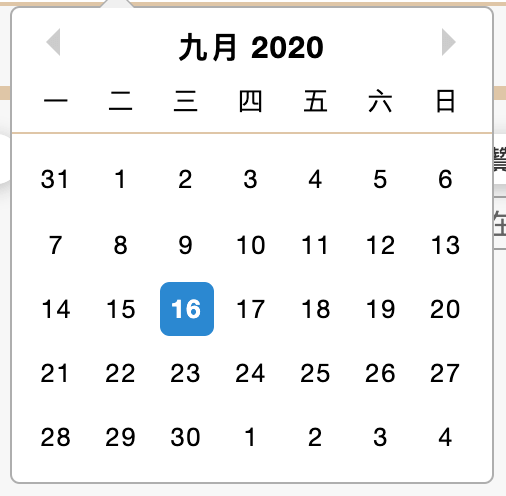

在做搜尋選單時，常常會有些日期需求

沒有 UI 的幫助話，這時用 react-datepicker(以下簡稱 datepicker) 就是一個很方便的選擇

[react-datepicker](https://reactdatepicker.com)


使用方式跟文件上寫的一樣，也很方便，這篇主要是談論如何把它中文化的部分

不過這做法，似乎其實也可以延伸到 datepicker 的 i18n 的設定方式吧 （笑

---

非英語系國家，雖然我們開發者看得懂英文，但不見得業主可以接受英文

所以先去官方文件看看，datepicker 有沒有做 local 的 i18n （想太美好

結果裡面有一個 locale 的參數可以去做地名設定，但其實這邊的 local 只是在指當地參考時間的 local time 並不會把整個 datepicker 變成中文化

```
() => {
  const [startDate, setStartDate] = useState(new Date());
  return (
    <DatePicker
      selected={startDate}
      onChange={date => setStartDate(date)}
      locale="en-GB"
      placeholderText="Weeks start on Monday"
    />
  );
};
```

主要運用 [date-fns](https://date-fns.org) 來解決這問題

```
$npm i date-fns
```

官方文件好像沒有很明確地表示有哪些國家語言，參考其他人寫法，發現台灣中文在 date-fns 是這樣引入

```
import zhTW from "date-fns/locale/zh-TW";

 <DatePicker
    locale={zhTW}
    ...
  />
```

可以直接使用，但也有人用 datepicker 的 registerLocale 做引入

```
import DatePicker, { registerLocale } from "react-datepicker";
import el from "date-fns/locale/el"; // the locale you want
registerLocale("el", el);

<DatePicker
    locale="el"
    ...
/>
```



---

[reference]

[Change locale in react-datepicker](https://stackoverflow.com/questions/54399084/change-locale-in-react-datepicker)

---

> 好像有時發發這種簡單功能的文章也不錯
