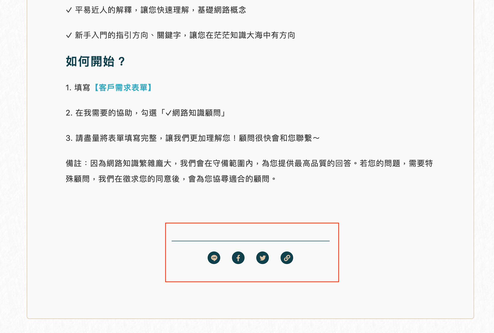
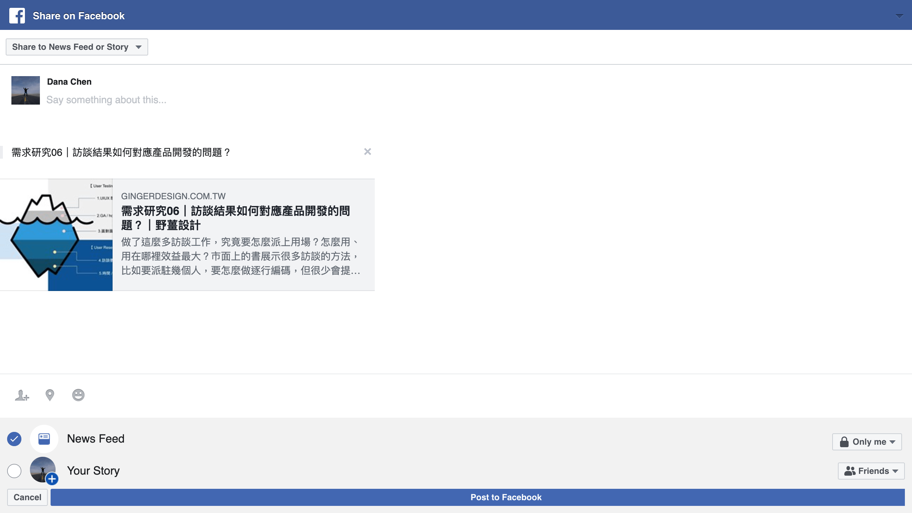
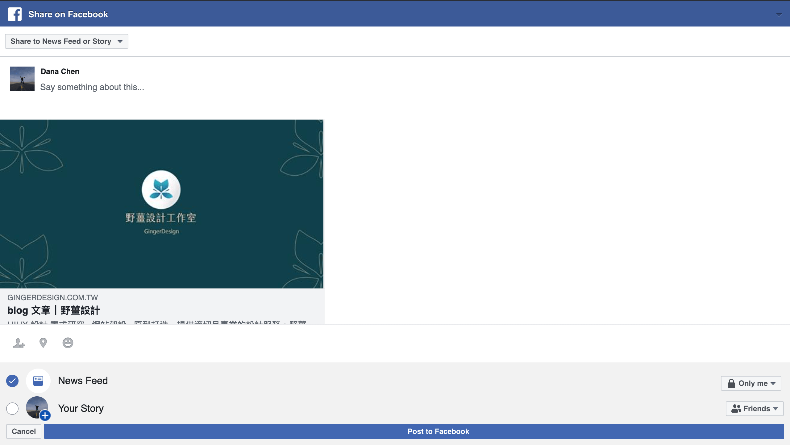

> 雖然這篇是在 2020 發布的，但其實文章早在 2019 年底就寫好了，不過發布時也有把功能再測過，發現原本可以用功能有些就壞了，有些換了新方法...所以如果當你看到這篇並拿其中一個測試，然而卻有成功的話，那就可能是官方把問題修好了ＸＸＤ

---

seo 有一個績效叫做 “白帽 seo”

意思是指如果是藉由正常好的外部網站，點擊你的網站連結連到你的網站，這樣就會算是一個好的效益，這樣你的網站會在 seo 上加分

所以通常會在自己網站文章頁面底下，加上方便用戶分享的按鈕，這樣用戶只要一點擊，就可以直接分享到社群，不用複製連結然後再貼給對方



這邊簡單介紹在台灣最常用到的幾個社群分享(facebook, line, twitter)

---

# facebook

**fb 這邊要注意，如果使用手機點擊網頁的 fb 分享的話， 不會像另外兩個 share 的方式，可以開啟已安裝的應用程式直接分享，因為 fb 即使到 2020 也是另開一個網頁新分頁做分享...**

[Sharing on Facebook](https://developers.facebook.com/docs/sharing/overview/)

## url sharing

### share dialog

fb 的 dialog 有三種分享方式，[Share Dialog](https://developers.facebook.com/docs/sharing/reference/share-dialog)、[Feed Dialog](https://developers.facebook.com/docs/sharing/reference/feed-dialog)、[Send Dialog](https://developers.facebook.com/docs/sharing/reference/send-dialog)

這邊介紹 [Share Dialog](https://developers.facebook.com/docs/sharing/reference/share-dialog) 的方式

fb share link 基本是

```
https://www.facebook.com/dialog/share?app_id=${AppID}&href=${ShareLink}
```

- `app_id` 就是在 [facebook develop myApps](https://developers.facebook.com/apps/) 申請的 App ID
- `href` 你要分享的網址連結

**fb 分享 url 測試時不能帶 localhost 網址，要帶實體網址才會過**

也可以加上其他需要的 query

- `hashtag` 直接帶入含 `#` 的 hashtag，例如 `#野薑設計`
- `quote` 雖然不太算是帶入分享的人的文章框裡的正式做法，但通常我會帶入想要分享的文字內容
- `redirect_uri` 分享後網頁要導向哪裡，我這邊通常會帶 fb 首頁，因為理論自己分享完後可以看到自己的 fb 首頁會有剛剛分享的內容

`[ 20201127 ] 測試`

- redirect_uri 無法正確導向設定的 uri
- hashtag 帶入沒有反應

所以通常 fb 分享網址會長這樣

```
https://www.facebook.com/dialog/share?app_id=${AppID}&href=${ShareLink}&quote=${TEXT}&hashtag=#tag&redirect_uri=https://facebook.com
```



至於分享 fb 時，fb 小卡上面的小卡，就是 seo meta og 相關的 tag

可以至 [sharing debugger](https://developers.facebook.com/tools/debug/) 去試試看自己的網址分享後會不會是自己想要的格式

### sharer.php

網路上也有找到這種分享的 url，不用 appID 感覺看起來是以前舊版本的分享方式

```
https://www.facebook.com/sharer/sharer.php?u=https://${url}

https://www.facebook.com/sharer/sharer.php?u=https://gingerdesign.com.tw/blog/
```



可以看到其實跟上面 share dialog 的分享畫面不太一樣

## SDK sharing

官網也有提供另外一個 SDK 的分享方式，但因為要另外安裝 fb 的 script ，所以我通常不是選擇這種分享方式

    FB.ui({
        display: 'popup',
        method: 'share',
        href: 'https://developers.facebook.com/docs/',
      }, function(response){});

method 跟 url sharing 一樣也有三種 Share、Feed、Send

## 使用 fb:// 開啟 application

(非官方做法)

原本想要解決 fb 分享開頭提到的，在手機上做分享不會自動開啟已安裝的 fb app，所以在網路上找到這種偏方

用 `<a>` tag 直接開啟 `fb://` 開頭的 link

**這邊要先強調這是非官方使用方式，會隨者 fb 開發者更改版本進而改語法方式**

直接開啟 fb app 到個人頁面

```
For iOS: fb://profile/PAGEID
For Android: fb://page/PAGEID
```

```
fb://profile/4 -> 就會打開 Zuckerberg 的個人粉絲頁
```

分享到 fb message

```
fb-messenger://share?link=https://gingerdesign.com.tw
```

---

# line

[line 分享 官方文件](https://org-media.line.me/zh_TW/how_to_install#lineitbutton)

## 舊版

`[ 20201127 ]` 測試依然可以使用且正常

```
http://line.naver.jp/R/msg/<CONTENT TYPE>/?<CONTENT KEY>
https://line.naver.jp/R/msg/text/?${sharingText}%20https://${url}

http://line.naver.jp/R/msg/text/?test%20message%0D%0Ahttp%3A%2F%2Fline.naver.jp%2F
```

- 其中的 <CONTENT TYPE> 目前也就 text 而已, 而重點在於 <CONTENT KEY>, 內容主要是代入傳遞的內容, 可以傳入任意不違反 line 傳送內容規定的文字, 記得要用 utf-8 編碼.
- 可分享的資訊內容僅限文字。目前不支援圖片、影片及語音等。
- 分享內容的字數上限為 2,500 個字。
- 換行符號為 %0D%0A

`[ 20191125 ]` 分享時內容字數太多，在未登入 line 的網頁版出現 400 error 的問題

未登入時，會同時挾帶文字並導向 line 登入介面，若夾帶太多字元會導向登入頁面會自己擋掉，然後再自己導向 line 本身的 400 bad request。但在手機分享，或已經登入 line 的 web 分享會是正常的，初步估計是 line 在網頁登入官方沒設定好(比如說字數太多或是 file size 的問題)

`[ 20191127 ]` 桌機版 text 會亂碼，但是手機版是正常的

在桌機版 text 可能因為符號關係，所以會轉譯成亂碼，但手機版卻沒有此問題，因此建議所有 text 都要 encode 後帶入

## 新版

2020 發現分享連結換成新版的連結

```
https://social-plugins.line.me/lineit/share?url={encodeURIComponent(URL)}

https://social-plugins.line.me/lineit/share?url=https%3A%2F%2Fline.me%2Fen
```

如果要夾帶文字格式變成這樣

```
https://social-plugins.line.me/lineit/share?url={encodeURIComponent(URL)}&text={encodeURIComponent(text)}

https://social-plugins.line.me/lineit/share?url=https%3A%2F%2Fline.me%2Fen&text=test%20message
```

新版跟舊版的差別，大概是在手機分享時，會先判斷你網頁有沒有登入，有的話才會做轉址，沒有的話就會要你先登入，舊版是直接導向 line app 不會在網頁做判斷

重點是，新版的手機 text 是不能用的啊啊啊啊啊 😭😭😭

`[ 20201127 ] 測試` 夾帶文字是桌機可以用但是手機不能用ＱＱ

> 希望 line 的官方分享文件不要只做好看易於使用，該寫的內容都沒有寫進去，每次都找得好辛苦ＱＱ

---

# twitter

[Tweet share button](https://developer.twitter.com/en/docs/twitter-for-websites/tweet-button/guides/parameter-reference1)

```
https://twitter.com/intent/tweet?text=${sharingText}&url=https://${url}&hashtags=${hashtags}
```

### Tweet content parameters

- text 想要分享的文字內容
- url 分享的網址連結
- hashtags 分享的 hashtags，可以分享多個，用 `,` 分該就好 `example,demo`
- via 分享的帳號，例如 `twitterdev`
- related 跟分享內容有關的帳號 `twitterapi,twitter`

`[ 20191122 ]`

因為 twitter sharing url 不支援帶有 query 的 url，在 post 預覽頁面會看起來很正常，但是在 post 後 twitter 會自己 decode 然後在 query 符號讓 url 斷在很奇怪的地方，即使是放在 text 後也是會讓 query 斷在詭異地方

例如， twitter share url 帶有 query 時會斷在 `= & ]` 等 符號，分享文章會很詭異，點擊貼文的 url 得到的也不是當初想分享的連結，而是 `https://test.tw/post?q[tagged`

[Sharing a URL with a query string on Twitter](https://stackoverflow.com/questions/6208363/sharing-a-url-with-a-query-string-on-twitter)

雖然是偏方，但最快的解法是，針對 `query` encode 兩次

```
const query = a=123&b=456;
const url = `https://example.com/test?${encodeURIComponent(encodeURIComponent(query),)}`;

const twitterSharingURL=`https://twitter.com/intent/tweet?&url=${url}`

```

btw query 套件可以用 [qs](https://www.npmjs.com/package/qs) 來做 query，直接把 query 變成 object，而且會自動分別 fb 自動夾帶的 query

---

[reference]

[Correct way in 2018 to open Facebook app via website link?](https://stackoverflow.com/questions/50683354/correct-way-in-2018-to-open-facebook-app-via-website-link)

[Open a facebook link by native Facebook app on iOS](https://stackoverflow.com/questions/10416338/open-a-facebook-link-by-native-facebook-app-on-ios)

[Social Sharing Buttons with zero JavaScript to Twitter, Reddit, LinkedIn, and Facebook](https://swimburger.net/blog/web/social-sharing-buttons-with-zero-javascript-to-twitter-reddit-linkedin-and-facebook)

[👍🏻 social-share-urls](https://github.com/bradvin/social-share-urls)

[👍🏻 how-to-use-the-web-share-api](https://css-tricks.com/how-to-use-the-web-share-api/)

[Facebook Share doesn’t open native app on mobile.](https://onlinecommunityhub.nl/forum/jssocials/118-facebook-share-doesn-t-open-native-app-on-mobile)

---

> 當初寫完原本就想分享了，誰知道休息一下官方格式又變惹，結果一拖再拖就越改越多 ＱＱ
